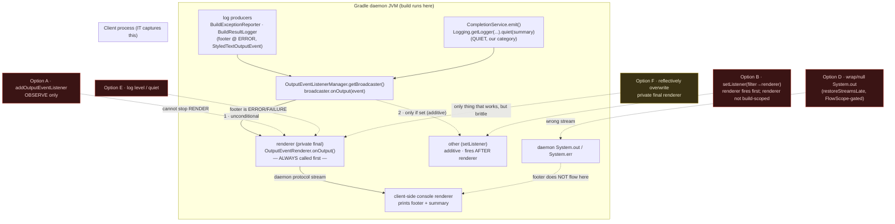

# #25 — Gradle Build-Failure Footer Leak: Investigation Record

> Scope: why the compactor cannot suppress Gradle's failure footer (`FAILURE: / * What
> went wrong: / BUILD FAILED in Xs`) on a genuinely-failed build, what was tried, and
> what remains. Three granularity levels: **Summary**, **Current State**, **Options
> Investigated**. Environment unless noted: **Gradle 9.5.1**, **JDK 17+**, daemon mode.

---

## Level 1 — Summary (TL;DR)

- On a **genuinely-failed** build (e.g. `compileJava` with a compile error) the compactor
  emits its JSON/human summary correctly, **but Gradle's own failure footer also prints** —
  the build error is double-reported (compacted + raw).
- The footer is **not** written to `System.out`/`System.err`. It is rendered by Gradle's
  **logging pipeline** in the daemon and streamed to the client, where the client's console
  renderer prints it. The daemon JVM's streams are bypassed entirely. **Proven empirically.**
- Therefore every stream-redirection strategy (null `System.out`, late restore, FlowScope-gated
  wrapper) **cannot work at any timing**. Confirmed by probe + by the fact the shipped
  `restoreStreamsLate` machinery never suppressed the footer.
- Every plugin-reachable **event-listener** strategy also cannot suppress: Gradle's broadcaster
  always calls the terminal `renderer` first (bytecode-proven), and the terminal renderer
  (`OutputEventRenderer`) is **not** in build-scoped services.
- The only mechanism that could suppress is **reflective overwrite of a `private final` field**
  on a Gradle-internal class — brittle, JDK/Gradle-version-bound. **Rejected** for a tool that
  runs across arbitrary user toolchains.
- The existing `test`-task "suppression works" test is a **false positive**: the fixture sets
  `ignoreFailures = true`, so its build never fails and no footer is ever emitted. Suppression
  works for **neither** test nor compile failures; the fixture just hid the gap.
- **Decision: accept the footer as correct CLI behaviour on a failed build; document as a known
  limitation; fix the dishonest test; optionally retire the dead late-restore machinery.**

---

## Diagram — why the footer leaks (and where each option dies)



Reading it: every event funnels through the broadcaster, which calls the **terminal `renderer`
unconditionally before anything a plugin can attach**. The renderer streams to the client over the
daemon protocol — **not** via the daemon's `System.out`. So stream tricks (D) target a path the
footer never uses, listener tricks (A/B) sit downstream of a renderer that already fired, and log
level (E) can't lower an ERROR/FAILURE event. Only overwriting the `private final renderer` (F)
intercepts before the client — at the cost of fragile reflection.

---

## Level 2 — Current State

### What works
- Summary emission. Path: `CompletionService.emit()` →
  `org.gradle.api.logging.Logging.getLogger(CompletionService.class).quiet(renderedSummary)`
  (`CompletionService.java:308`). The summary rides the logging pipeline at **QUIET**, category
  = logger name `io.llmcompactor.gradle.CompletionService`. It is *not* written via `System.out`.
- In-build noise suppression (task stdout, test logging, lint) via
  `BuildOutputSuppressor` — log level set to ERROR, `captureStandardOutput(DEBUG)`,
  `testLogging` events disabled, etc.

### What does NOT work (the #25 gap)
- Gradle's terminal failure footer leaks on any genuinely-failed build. Two source categories,
  both `StyledTextOutputEvent` at `LogLevel.ERROR`:
  - `org.gradle.internal.buildevents.BuildExceptionReporter` → `FAILURE: / * What went wrong: /
    * Try:` + the indented compiler output.
  - `org.gradle.internal.buildevents.BuildResultLogger` → `BUILD FAILED in Xs`.

### Dead / misleading code & tests
- `CompletionService.restoreStreamsLate()` (`:165`) + `pendingRestore` + the 2000 ms
  `ScheduledExecutorService`. **Stated purpose** (comment `:170`): keep `System.out` null for a
  window *after* `BuildService.close()` so "Gradle's final failure reporting … is caught by the
  current null redirection." **This premise is false** — footer never goes through `System.out`.
  The during-build stream nulling is a *separate* concern and may still matter; the
  after-close/2 s footer half is provably inert.
- `integration-tests/.../GradleBuildOutputTests.testNoGradleFailureSummary` — asserts
  `doesNotContain("* What went wrong:")` on the **`test`** task of `gradle-test-project`, which
  sets `ignoreFailures = true` → build SUCCEEDS → no footer ever. Passes **vacuously**.
- `gradle-test-project/build.gradle` `ignoreFailures = true` (~`:50`) — the masker. **Removed.**
  This flips `testNoGradleFailureSummary` red (footer leaks) — now `@Disabled` — and changes the
  fixture to exit-non-zero. `testUnknownProperty` (previously asserted `exitCode == 0`) was
  re-pointed at its true intent (summary still emits, property not surfaced as a config error)
  rather than restoring the mask.
- `gradle-compile-error-project/gradle.properties` (`org.gradle.logging.level=quiet`) — **no-op
  for the footer only**: the footer renders at `ERROR`/FAILURE regardless of level. It is *not*
  dead overall — it is the one lever for the **pre-plugin-apply window** (Gradle banner, daemon
  notice, `buildscript{}` block) that `BuildOutputSuppressor`'s `setLogLevel(ERROR)` (`:32`) cannot
  retroactively gate. **Kept.**
- `GradleBuildOutputTests.testNoGradleFailureSummaryForCompileErrors` — the #25 reproduction;
  belongs `@Disabled` as the known-limitation marker (it is the one honest footer spec, on a
  genuinely-failing project).

### Resolution (applied)
1. `ignoreFailures` removed from `gradle-test-project` — fixture now fails honestly.
2. `testNoGradleFailureSummary` `@Disabled` (vacuous; could only pass under the mask).
3. `testNoGradleFailureSummaryForCompileErrors` `@Disabled` as the #25 marker.
4. `testUnknownProperty` re-pointed at its real intent (summary emits, no config error) instead
   of asserting `exitCode == 0`.
5. `gradle-compile-error-project/gradle.properties` kept (load-bearing for pre-apply noise).
6. (Optional, not done) Retire the after-close footer half of `restoreStreamsLate` + the 2 s
   timer; keep the during-build nulling.
7. (Optional, not done) Rewrite the #25 row in `src-main-review.md` with this diagnosis.

---

## Level 3 — Options Investigated (full evidence)

### Architecture facts established

**Daemon → client output model.** Even under `--no-daemon`, JVM settings force a *single-use
daemon* ("a single-use Daemon process will be forked"). The build runs in the daemon; console
output reaches the client (the process the IT captures) via the daemon protocol, rendered by the
**client-side** console renderer. The daemon JVM's `System.out`/`System.err` are not the footer's
path.

**Logging pipeline (Gradle 9.5.1, `gradle-logging-9.5.1.jar`).**
- Producers write to `OutputEventListenerManager.getBroadcaster()` — an
  `org.gradle.internal.logging.events.OutputEventListener`.
- `org.gradle.internal.logging.sink.OutputEventListenerManager` fields (javap):
  - `private final OutputEventListener renderer;`  ← terminal sink (the real
    `OutputEventRenderer`), set in the constructor.
  - `private OutputEventListener other;` ← set by `setListener(...)`, cleared by `removeListener`.
  - `private final OutputEventListener broadcaster;` ← inner class `OutputEventListenerManager$1`.
- Broadcaster routing (`OutputEventListenerManager$1.onOutput`, bytecode):
  ```
  renderer.onOutput(event);                      // access$000 = renderer — ALWAYS
  if (other != null) other.onOutput(event);      // access$100 = other — additive only
  ```
  → `setListener` is **additive**, not a replacement. The terminal `renderer` fires first, every
  time. No plugin-installed listener can prevent it.

**Key classes / APIs / FQNs.**
| Role | FQN | Notes |
|------|-----|-------|
| Listener iface | `org.gradle.internal.logging.events.OutputEventListener` | `void onOutput(OutputEvent)` |
| Base event | `org.gradle.internal.logging.events.OutputEvent` | `LogLevel getLogLevel()` |
| Categorised | `org.gradle.internal.logging.events.CategorisedOutputEvent` | `String getCategory()`, `getLogLevel()`, `getTimestamp()` |
| Footer events | `org.gradle.internal.logging.events.StyledTextOutputEvent` | extends Renderable→Categorised; the footer's concrete type |
| Text log event | `org.gradle.internal.logging.events.LogEvent` | `getMessage()`, `getThrowable()` (NOT the footer's type) |
| Renderable | `org.gradle.internal.logging.events.RenderableOutputEvent` | `render(StyledTextOutput)` |
| Manager | `org.gradle.internal.logging.sink.OutputEventListenerManager` | `setListener`/`removeListener`/`getBroadcaster`; build-scoped reachable |
| Terminal renderer | `org.gradle.internal.logging.sink.OutputEventRenderer` | `onOutput`, `addOutputEventListener`, `attachConsole`; **NOT build-scoped** |
| Logging facade | `org.gradle.internal.logging.LoggingOutputInternal` | `addOutputEventListener`/`removeOutputEventListener`; `services.get(...)` returns `DefaultLoggingManager` (no `onOutput`) |
| Footer sources | `org.gradle.internal.buildevents.BuildExceptionReporter`, `org.gradle.internal.buildevents.BuildResultLogger` | the two categories to filter |
| Summary logger | `io.llmcompactor.gradle.CompletionService` (via `org.gradle.api.logging.Logging`) | QUIET; distinct category, safe from any footer filter |

**Tracer spike result (observe-only `OutputEventListener` added via `LoggingOutputInternal`).**
Distinct `class|level|category` seen on a `compileJava` failure:
```
14× StyledTextOutputEvent|ERROR|org.gradle.internal.buildevents.BuildExceptionReporter
 2× StyledTextOutputEvent|ERROR|org.gradle.internal.buildevents.BuildResultLogger
 4× StyledTextOutputEvent|ERROR|system.err            (javac error echo)
14× ProgressCompleteEvent|LIFECYCLE|-
10× ProgressStartEvent|LIFECYCLE|...ProgressLoggerFactory
 2× EndOutputEvent|null|-
 1× LogLevelChangeEvent|null|-
```
→ Footer filter target is precise: drop `StyledTextOutputEvent` whose category is the two
`buildevents.*` classes. Summary (QUIET, our category) is untouched.

### Option A — `LoggingOutputInternal.addOutputEventListener` (observe)
- API exists and works for **observation** (this is how the tracer ran).
- **Cannot suppress** — adding a listener does not stop the terminal renderer. Dead end for the
  fix; useful only as the diagnostic tracer. Used here to pin the categories above.

### Option B — `OutputEventListenerManager.setListener(filter → renderer)`
- Idea: replace the sink with a filter that forwards non-footer events to the real renderer.
- **Fails** on two counts, both verified:
  1. `setListener` sets `other`, which is **additive**; `renderer` still fires first (bytecode).
  2. The renderer handle isn't cleanly obtainable: `services.get(OutputEventRenderer.class)` →
     *"No service of type OutputEventRenderer available in Build-scoped services"* (probe v3).
     `services.get(LoggingOutputInternal.class)` returns `DefaultLoggingManager`, which has **no
     `onOutput`** — forwarding to it throws `MissingMethodException` per-event and hangs the build
     (broke the flush/end lifecycle; probe v2).

### Option C — `gradle.useLogger(Object)` (replace logging UI)
- The historical "clean" lever. **Removed in Gradle 8/9.** Not available on 9.5.1. Dead.

### Option D — Stream wrapping / `System.out` null (incl. `restoreStreamsLate`, FlowScope-gated)
- Premise: footer is written to `System.out`/`System.err`; wrap or null them (timed to an
  end-of-build signal such as `FlowScope.always {}`) and the footer evaporates.
- **Disproven empirically.** Probe: `System.out` AND `System.err` replaced with a
  byte-swallowing `PrintStream(new ByteArrayOutputStream())` for the **entire** build via init
  script, never restored. Footer still printed in full to the client (`* What went wrong:`,
  `Execution failed for task ':compileJava'`, `BUILD FAILED in 2s`).
- Conclusion: the footer never traverses the daemon JVM's streams. **No stream strategy works at
  any timing.** FlowScope (`org.gradle.api.flow.FlowScope` / `FlowAction`, incubating, 8.1+) only
  controls *when* a flag flips; it does not change *which* stream the footer uses. This is also
  why the shipped `restoreStreamsLate` 2 s window never suppressed anything.

### Option E — Log level / `gradle.properties` `org.gradle.logging.level=quiet`
- **No effect on the footer.** It renders at `ERROR`/FAILURE priority, shown regardless of level
  (Gradle `LogLevel` order: `DEBUG < INFO < LIFECYCLE < WARN < QUIET < ERROR`; `quiet` still passes
  `ERROR`). Confirmed: adding the property to `gradle-compile-error-project` did not suppress;
  nulling at `-q` still prints. `BuildOutputSuppressor` setting `startParameter.logLevel = ERROR`
  (`:32`) is irrelevant to the footer for the same reason.
- **Caveat — not a blanket no-op.** `org.gradle.logging.level=quiet` *does* gate the pre-plugin
  -apply window (banner, daemon notice, `buildscript{}` lifecycle) that the programmatic
  `setLogLevel(ERROR)` runs too late to catch. Dead against the footer; live for early noise.

### Option F — Reflective overwrite of `OutputEventListenerManager.renderer`
- `renderer` is `private final`. Reflectively replacing it with a filtering wrapper is the only
  remaining mechanism that could actually suppress before the console.
- **Rejected:** final-instance-field mutation via reflection is increasingly restricted on JDK
  17+, depends on Gradle internal layout that has no stability guarantee, and would need
  re-validation on every Gradle/JDK bump. Unacceptable maintenance liability for a tool that
  must run across arbitrary user toolchains.

### Option G (chosen) — Accept the footer; fix tests + docs
- On a genuinely-failed build, Gradle printing its failure cause is correct CLI behaviour; the
  only "bug" is that the compactor *also* summarises it. Fighting Gradle's own reporter with
  fragile internals is disproportionate.
- Actions: see "Recommended resolution" in Level 2.

---

## Provenance
- Prior footer-fix attempt: `7289eb7` ("late stream restoration … to suppress Gradle's final
  failure block") — built on the disproven Option D premise.
- `src-main-review.md` Addendum F frames this as a missing end-of-build event problem and eyes
  `FlowScope` / a shutdown hook. The probes here show the axis is wrong: the blocker is the
  *stream*, not the *timing* — so neither FlowScope nor a shutdown hook helps.
- All findings from direct javap/bytecode reads of `gradle-logging-9.5.1.jar` and four init-script
  probes against a throwaway `compileJava`-failure project (no plugin needed for the renderer/
  stream probes).
