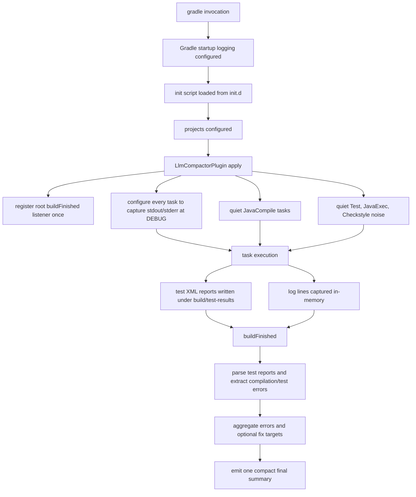

# Gradle Design

## Introduction

This document describes how the Gradle side of `llm-build-compactor` works today, why it is structured differently from the Maven path, and which parts of the Gradle lifecycle matter for output suppression.

The goal is simple:

- suppress noisy Gradle build output that inflates LLM context
- preserve enough signal to understand failures
- emit one compact final summary at the end of the build

For Gradle, this has to be done with the grain of Gradle's logging system rather than by assuming `System.out` and `System.err` can be globally swapped late in the build.

## Design Constraints

Gradle does not provide the same early lifecycle hooks that Maven provides for this problem.

Maven gives this project a lifecycle extension point via `EventSpy`, which can silence output very early and print a final summary at session end. Gradle does not have a directly equivalent public extension point for full-build output interception.

The important constraints are:

- Gradle configures a large part of its logging pipeline before normal plugin code runs.
- Build output may come from Gradle lifecycle events, task logging, compiler output, test frameworks, Ant-based tools, and worker processes.
- Changing `System.out` or `System.err` inside normal plugin application is not enough to silence everything.
- Some output is already inside Gradle's logging/event pipeline by the time the plugin sees it.

That means the Gradle implementation is necessarily more layered than the Maven extension model.

## Relevant Lifecycle

The current Gradle path uses two stages:

1. an init script, installed into Gradle user home, for broad late build-scoped suppression setup
2. the Gradle plugin itself, applied in the target build, for task-level quieting, log capture, test result parsing, and final summary emission

The timing matters:

- Startup logging configuration happens very early in Gradle.
- Init scripts run before project build scripts, but still after some startup logging decisions.
- Plugin `apply()` runs during project configuration.
- `buildFinished` is the reliable point for emitting the final compact summary.

## Current Flow

## How Suppression Is Achieved

### 1. Init Script Bootstrap

The plugin installs an init script resource into Gradle user home:

- `gradle-plugin/src/main/resources/llm-compactor-init.gradle`

This script handles broad build-scoped logging setup that is useful across builds, particularly for test logging suppression and standard output capture in places where the normal plugin hook is too late or too narrow.

This is not equivalent to Maven's full early-session control, but it is the closest Gradle analogue available without requiring custom launcher changes.

### 2. Root-Level Plugin Registration

The plugin registers its main listener once at the root build:

- `gradle-plugin/src/main/java/io/llmcompactor/gradle/LlmCompactorPlugin.java`

This avoids duplicate summaries in multi-project builds and ensures that summary generation happens once for the entire build, not once per subproject.

### 3. Task-Level Log Suppression

The most important practical suppression mechanism is task-scoped logging capture.

For enabled builds, each task is configured so its captured stdout and stderr are downgraded to `DEBUG`. Under the quiet logging mode used by the compactor, those lines are then filtered out before they reach the console.

This is what suppresses noisy categories that were otherwise still leaking:

- compiler `Note:` lines
- annotation processor warnings emitted through task output
- Checkstyle chatter
- SLF4J bootstrap warnings
- other task-scoped stdout/stderr noise

This was the key difference between "partially quiet" and "actually quiet in real builds".

### 4. JavaCompile-Specific Quieting

`JavaCompile` tasks also get additional compile options applied:

- warnings disabled
- deprecation output disabled
- specific compiler args added to reduce warning noise

This does not solve the whole problem alone, but it reduces noise at the source before Gradle has to filter it.

### 5. Test Result Parsing Instead of Console Parsing

The Gradle path does not rely only on console text to understand test failures.

Instead, on `buildFinished`, the plugin walks each project's `build/test-results` directory and parses the XML results. This produces:

- total tests run
- failure counts
- exception types
- source files and lines where available
- compressed stack traces
- optional duration data

This is why the compactor can still provide useful failure summaries even when the live console output is heavily suppressed.

### 6. Final Summary Emission

At the end of the build, the plugin:

- aggregates extracted errors
- optionally generates fix targets
- optionally includes recent Git changes
- renders one human-readable or JSON summary

The summary is emitted at build end as the primary user-visible output of the compactor.

## Property Handling

The Gradle plugin reads configuration through Gradle's own `findProperty()` API, which natively resolves `-D` command-line flags, `gradle.properties`, and plugin extension values in a consistent priority order. This is unlike the Maven extension, which must explicitly check `session.getUserProperties()` because Maven `-D` flags are user properties and may not be propagated to JVM system properties.

As a result, the Gradle property path is simpler and has no equivalent to Maven's plugin-XML-overriding-CLI-flag failure mode.

## Why Lifecycle Details Matter

The lifecycle constraints explain several non-obvious design choices:

- The plugin cannot rely purely on `System.setOut()` and `System.setErr()` during `apply()`.
- Some Gradle output is already a Gradle logging event, not raw process text.
- Startup-level Gradle behavior and task-level logging behavior are different problems.
- Suppression that works for one task type may fail for another unless task logging capture is applied broadly.
- End-of-build summary emission must happen once, at root scope, after all test reports exist.

Without understanding those lifecycle boundaries, the implementation looks more complicated than it really is.

## Multi-Project Behavior

The current design is intended to work correctly for multi-project builds:

- the plugin registers summary emission once at the root build
- each subproject's test result directories are scanned
- task-level noise suppression is applied across all projects

That is important because many real-world Gradle builds, including Micronaut-based builds used during testing, are multi-module and produce noise from many subprojects before any single summary could be emitted.

## Current Tradeoff

The current Gradle design chooses:

- aggressive suppression of task/lifecycle noise
- reliable structured summary generation
- minimal final console output

over:

- preserving the normal Gradle footer and per-task console visibility

That is intentional for the LLM-focused use case.

## Code Map

The main pieces are:

- `llm-build-compactor-gradle-plugin/src/main/java/io/llmcompactor/gradle/LlmCompactorPlugin.java`
- `llm-build-compactor-gradle-plugin/src/main/resources/llm-compactor-init.gradle`
- `llm-build-compactor-core/src/main/java/io/llmcompactor/core/SummaryWriter.java`
- `llm-build-compactor-core/src/main/java/io/llmcompactor/core/parser/GradleParser.java`
- `llm-build-compactor-core/src/main/java/io/llmcompactor/core/StackTraceCompressor.java`

## Summary

Gradle output suppression in `llm-build-compactor` is achieved by combining:

- init-script bootstrap
- root-scoped plugin coordination
- broad task-level log capture
- task-specific quieting for noisy executors
- test-result parsing from XML reports
- a single end-of-build compact summary

That combination is what makes the Gradle path viable in practice, especially for large multi-module builds where raw console output would otherwise dominate the agent context.
