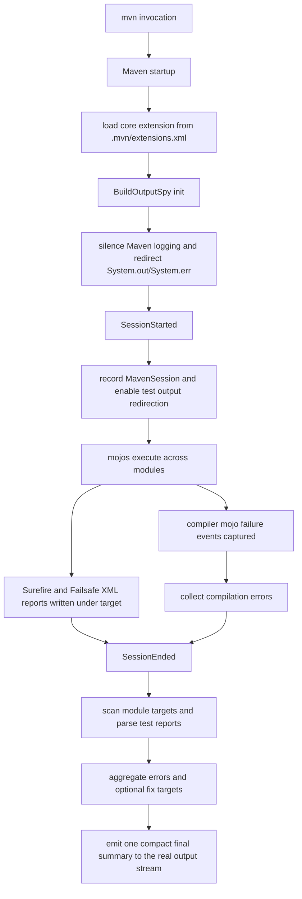

# Maven Design

## Introduction

This document describes how the Maven side of `llm-build-compactor` works today, why it uses a core extension instead of relying only on a normal Maven plugin, and how the final compact summary is produced.

The Maven design is the original strong-silence path in this project. It aims to:

- suppress noisy build output that inflates LLM context
- retain enough structured signal to understand failures
- emit one compact final summary at the end of the build

The design is centered on a core extension because Maven provides an early lifecycle hook model that can be used to silence output before the usual banners and plugin logs are emitted.

## Design Constraints

Maven does provide early lifecycle hooks for this problem, but only through the correct extension mechanism.

The important constraints are:

- a normal plugin executes too late to silence Maven startup and reactor output
- a build extension declared in `pom.xml` is also too late for complete silence
- the extension has to be active before Maven finishes bootstrapping logging
- compilation failures and test failures must still be recoverable after console suppression

That is why the Maven design is split into:

1. a core extension for early silence and session-end summary generation
2. a plugin fallback path for environments where the extension is not installed

## Relevant Lifecycle

The Maven path depends on where code enters the lifecycle:

- Maven starts up and initializes logging
- core extensions from `.mvn/extensions.xml` are loaded very early
- the build session begins
- Mojos execute during the lifecycle
- the session ends

The critical point is that a core extension is loaded early enough to suppress the normal console stream before most Maven noise is emitted. A normal plugin or a build extension from `pom.xml` is not.

## Current Flow

## How Suppression Is Achieved

### 1. Core Extension Installation

The preferred Maven path is installed by writing `.mvn/extensions.xml`:

- `llm-compactor-maven-plugin/src/main/java/io/llmcompactor/maven/LlmInstallMojo.java`

This points Maven at the `maven-extension` artifact so the compactor code is loaded as a **core extension** on the next build.

This is the key design decision for Maven. Without it, Maven has already emitted startup output before the compactor can intervene.

### 2. Early Extension Initialization

The main extension implementation is:

- `maven-extension/src/main/java/io/llmcompactor/extension/BuildOutputSpy.java`

On initialization, the extension:

- checks whether the compactor is disabled
- skips suppression for interactive goals such as `spring-boot:run` or `exec:java`
- stores the real output streams
- turns Maven's SLF4J simple logger level to `off`
- resets SLF4J so the change takes effect
- redirects `System.out` and `System.err` to null streams

That gives Maven its strongest suppression path.

### 3. Session-Aware Behavior

On `SessionStarted`, the extension captures the `MavenSession` and enables:

- `maven.test.redirectTestOutputToFile=true`

That pushes test stdout/stderr out of the console path and into files, which is much more compatible with the compactor model.

This property is set in **both** `session.getUserProperties()` and `System.setProperty()`. Surefire resolves its `@Parameter(property="maven.test.redirectTestOutputToFile")` via Maven's expression evaluator, which checks user properties. But some surefire configurations or Maven versions may also check system properties. Setting both ensures the redirect is picked up reliably across environments.

### 4. Compilation Error Capture

When the compiler mojo fails, the extension listens for the Maven execution event and extracts compilation diagnostics.

If the compiler output matches the structured extraction path, those errors are parsed into `BuildError` entries. If not, the extension falls back to a generic `COMPILATION_ERROR` entry so the summary still reports something useful.

### 5. Test Result Parsing from Reports

At session end, the extension walks the `target` directories for all projects in the Maven session and parses Surefire/Failsafe XML reports.

This produces:

- total test counts
- failure counts
- detailed test errors
- optional duration data
- stack traces compressed for LLM use

This is why Maven can stay quiet during the run and still produce useful failure details at the end.

### 6. Final Summary Emission

At `SessionEnded`, the extension:

- gathers parsed test failures
- adds captured compilation errors
- aggregates duplicate or related errors
- optionally generates fix targets
- optionally includes recent Git changes
- optionally writes JSON to a file
- emits one final human-readable or JSON summary

The summary is written to the real captured output stream, not to the suppressed console stream.

## Property Resolution Order

The extension resolves configuration values through `getProperty()` in this order:

1. `System.getProperty(key)` — JVM system properties
2. `session.getUserProperties().getProperty(key)` — Maven user properties (set by `-D` on the command line)
3. `MavenProject.getProperties().getProperty(key)` — POM `<properties>` block
4. Plugin XML configuration (`<configuration><key>value</key></configuration>`)
5. The hardcoded default from `CompactorDefaults`

**Why step 2 is explicit:** Maven `-D` flags (e.g. `-DllmCompactor.outputAsJson=false`) are user properties stored in `session.getUserProperties()`. Whether Maven also propagates them to JVM system properties depends on the Maven version and launcher. Checking user properties explicitly at step 2 ensures command-line flags always take precedence over plugin XML config regardless of how the Maven launcher is invoked.

**The consequence of missing step 2:** Without the explicit user-property check, a plugin XML value like `<outputAsJson>true</outputAsJson>` can override a command-line `-DllmCompactor.outputAsJson=false` flag, because the XML config is checked before the default but after the (potentially absent) system property.

## Fallback Plugin Path

Maven also has a fallback plugin path:

- `llm-compactor-maven-plugin/src/main/java/io/llmcompactor/maven/LlmCompactMojo.java`

This path exists for cases where the core extension is not installed.

The fallback Mojo:

- checks whether the extension is already active
- skips duplicate summary emission if the extension is present
- parses test reports from the current project's build directory
- writes the summary to `target/llm-summary.json` by default
- prints the summary to standard output

This path is useful, but it is not architecturally equivalent to the core extension:

- it runs later
- it cannot provide full early-session silence
- it depends on the normal lifecycle reaching the Mojo phase

So the fallback is functional, but the core extension is the preferred path.

## Why Lifecycle Details Matter

The lifecycle details explain the Maven design:

- a normal plugin is too late to suppress Maven startup noise
- a build extension declared in `pom.xml` is also too late for complete silence
- only a core extension can intervene before Maven has fully committed to its normal logging path
- session-end summary generation works well because XML test reports and execution state are available by then

This is why Maven can achieve a cleaner silence model than Gradle in this project.

## Multi-Module Behavior

The current Maven design is intended to work across the full reactor:

- the extension runs once for the Maven session
- it scans all projects in the session
- it aggregates failures across all module `target` directories
- it emits one final compact summary for the whole build

That is especially important for multi-module builds where raw Maven console output would otherwise contain long reactor tables, plugin banners, and repeated per-module lifecycle noise.

## Current Tradeoff

The current Maven design chooses:

- aggressive early silence
- one summary for the entire session
- structured report parsing and captured compilation failures

over:

- preserving normal Maven banners and per-plugin lifecycle output

That tradeoff is intentional for the LLM-focused workflow.

## Code Map

The main Maven pieces are:

- `maven-extension/src/main/java/io/llmcompactor/extension/BuildOutputSpy.java`
- `llm-compactor-maven-plugin/src/main/java/io/llmcompactor/maven/LlmInstallMojo.java`
- `llm-compactor-maven-plugin/src/main/java/io/llmcompactor/maven/LlmCompactMojo.java`
- `core/src/main/java/io/llmcompactor/core/SummaryWriter.java`
- `core/src/main/java/io/llmcompactor/core/parser/SurefireParser.java`
- `core/src/main/java/io/llmcompactor/core/StackTraceCompressor.java`

## Summary

Maven output suppression in `llm-build-compactor` is achieved by combining:

- a core extension installed via `.mvn/extensions.xml`
- early stream and logger suppression
- compiler failure capture from Maven execution events
- test result parsing from Surefire/Failsafe XML reports
- one compact final summary emitted at session end

That combination is what gives the Maven path its strongest "silent build, useful final summary" behavior.
